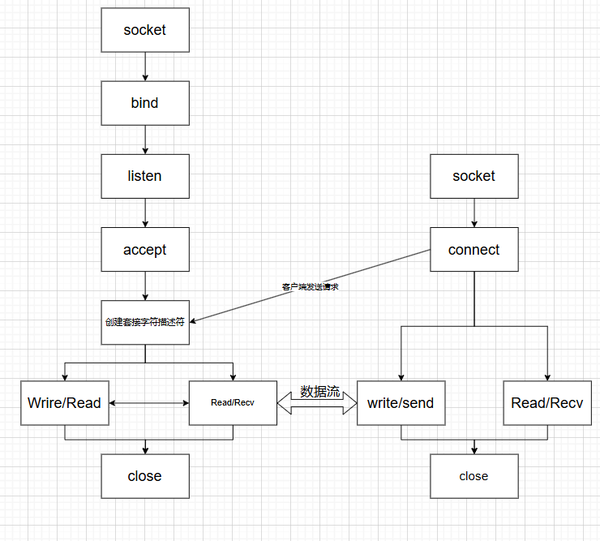

# 本地聊天室实现

## 组成：

服务端 + 客户端

## 总流程图：

## 服务端
### 功能：
能同时接受多用户的登陆，并将每个用户的聊天信息广播到其他用户；广播的时候会附加上发言的用户名；

### 实现

socket编程

###  服务器运行流程

## 客户端：

### 功能：
客户端能允许用户发言，并实时接收服务器的广播信息
### 实现：
python tk库
### 客户端运行流程：